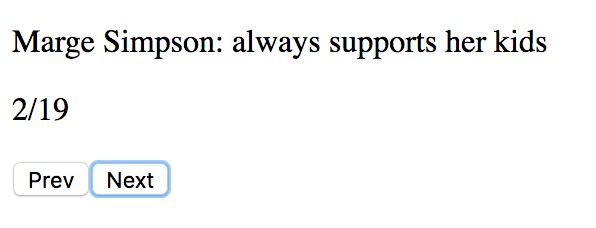

# Weekend Challenge 01

You'll be creating a carousel that will allow the user to move through an array of objects.

**Tech:** JQuery, JavaScript

## Base Mode

Enclosed is a JavaScript file that has an array of objects. Each one of you is represented as an object within this array.

One person at a time should be shown on the DOM represented by showing their name and their shout out. Include "Prev" and "Next" buttons, that when pressed, show the information for the previous or next person, respectively. These should wrap: clicking "Prev" when on the first person should wrap around to show the last person and vice versa. 

Also on the DOM should be a display showing the number of people and which is being currently viewed (eg. 2/20).

When a person is displayed, show their first name, last name and their shout out. Only one person should be shown at any given time.

### Example

## Hard Mode

Include a fade out and fade in animation in-between transitioning people. *HINT:* Google "jquery fadein" and see what comes up.

## Pro Mode

Include a timer that moves to the next person if the user is not clicking on "Next" or "Prev". If the user clicks on "Next" or "Prev", the timer should be reset. The timer should transition between people every 10 seconds.
        
